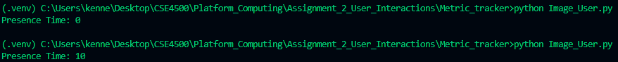

# Generate Users

PROVIDE OVERVIEW OF ASSIGNMENT HERE

Time spent: **NUMBER_HOURS_SPENT** hours spent in total

## Features

The following **required** features are completed:

- [X] Organize Github folders (2 pts)
- [X] Create a user with affinity towards keyword(s) and verify that it works (3 pts)
- [X] Create a user with affinity towards image(s) and verify that it works (3 pts)
- [X] Create a user with affinity towards links and verify that it works (3 pts)
- [X] Describe a user with unique affinities (1 pt)
- [X] Create a user with unique affinities and verify that it works (3 pts)
The following **bonus** features are implemented:

- [?] Create a unique user with an affinity OUTSIDE of keywords, images, or links (1.5 pt)
(Does using tags count for this ?)
- [ ] Uploaded files for a unique user BOTH in javascript and python (1.5 pt)
- [ ] DESCRIBE ANY OTHER FEATURES HERE.

## Screenshot and/or Video Walkthrough

## Notes:
PROVIDE RELEVANT OR ADDITIONAL INFORMATION HERE. Below are formatting options to add emphasis in text
<ul>
  <li>**Example in bold**</li>
  <li>*Example in italics*</li>
</ul>
